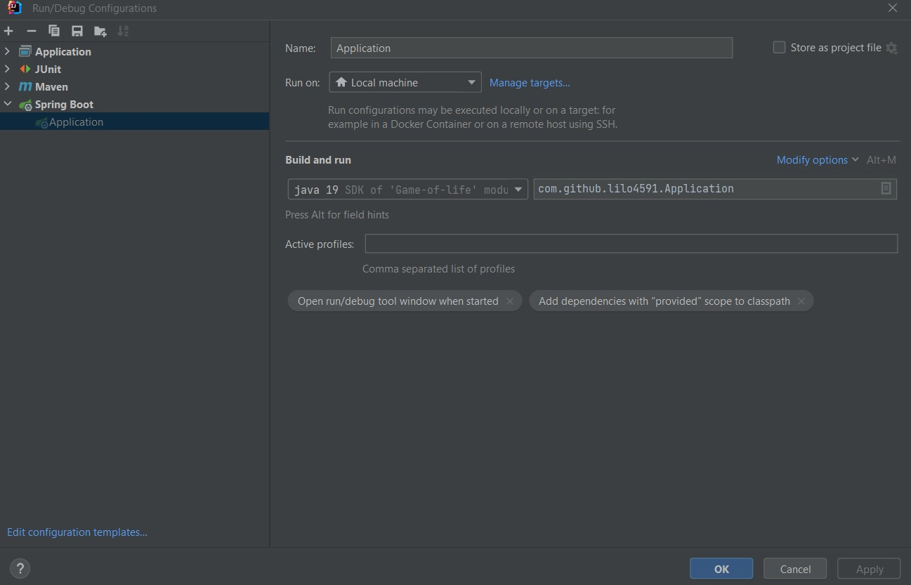

# Welcome the game of life service implementation
This is the service implementation of game-of-life use this together with the client application, which can be found here:
[game-of-life-client](https://github.com/lilo4591/game-of-life-client)

This is a springboot application written in java 19.

## Prerequisites 
Java 19

## Run app locally

This explanation assumes that you are using IntelliJ

Open the project in an editor of your choice, preferably in IntelliJ ;)

Build the project by maven clean install

Run app like this or just head to application.java and start from there


The app will start up on localhost:8080 which is springs default

### Example requests and responses


Service: GET

request: GET http://localhost:8080/game
Response:
```
{"rows":20,"columns":20}
```

Service: POST

url: http://localhost:8080/game
request:
```
{
    "coordinates": [[2,0], [0,0],[0,1],[0,1]]
}
```
Response:
```
{
    "coordinates": [[1,0],[1,1]]
}
```


### Improvements for future
* Error handling in service
* Implement service that takes size board instead of having them hardcoded in service
* Currently using the simplest way of handling edges, just count the neighbours as they are and skip cells outside the board. One could mirror the board and count the cell diagonally as a neighbour.
* Currently looping through the whole board in each update/tick with this implementation of a 2D boolean array. Not very good time complexity O(n*m) n=rows, m=columns. For very large boards this will take too much time. Change the implementation to use hashmaps instead.